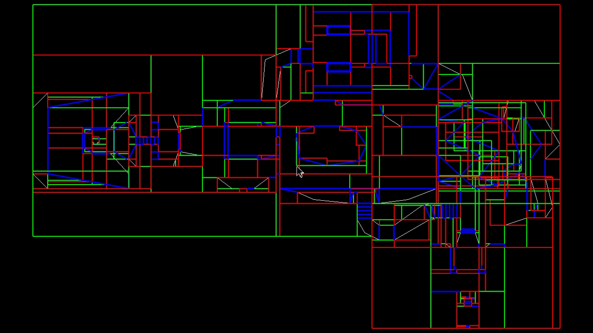

# DOOM OpenGL Engine 🚀🎮

Um motor de renderização 3D simplificado construído em C++ e OpenGL para visualizar mapas originais do Doom (.WAD).

<p align="center">
  
  
</p>
<p align="center">
  
  
</p>

## 🌟 Funcionalidades

- **Parser de WAD**: Leitura completa de cabeçalho, diretório e lumps de arquivos WAD.
- **Renderização 3D de Geometria**:
  - **Paredes**: Geração de geometria para linhas sólidas (1-sided) e portais (2-sided), tratando diferenças de altura entre setores (degraus, janelas).
  - **Pisos e Tetos**: Implementação robusta usando o algoritmo de **Ear Clipping** para triangulação de setores côncavos, garantindo uma cena sem buracos.
  - **Uso de SEGS**: Renderização baseada em segmentos pré-calculados para maior fidelidade ao design original.
- **Navegação 3D**:
  - Controle de câmera estilo FPS (WASD + Mouse).
  - Sistema de "voo" para exploração técnica do mapa.
  - Posicionamento automático no **Player 1 Start** original.
- **Texturas Reais do Doom**: Carregamento e renderização das texturas originais diretamente do arquivo WAD.
  - **Flats** (chão/teto): texturas 64×64 decodificadas via paleta `PLAYPAL`.
  - **Wall Textures**: texturas compostas (TEXTURE1/TEXTURE2), montadas a partir de patches via `PNAMES`.
  - **UV Mapping**: coordenadas de textura corretas para paredes (baseadas em `seg.offset` + xOffset) e chão/teto (world-space tiling).
  - **Batch Rendering**: geometria agrupada por textura — 1 VAO por textura, minimizando trocas de estado OpenGL.
  - **F_SKY1**: setores com teto aberto (céu) não geram geometria de teto.
- **Iluminação por Setor**: O `lightLevel` de cada setor modula a cor final da textura via fragment shader.
- **Iluminação Local via Ray Tracing (Real-time)**: 🚀
  - **Sombras Dinâmicas**: Algoritmo de intersecção raio-segmento 2.5D calculado em tempo real para cada pixel.
  - **Fontes de Luz Reais**: Extração automática de tochas, candelabros e lâmpadas dos `THINGS` do WAD.
  - **Efeitos Atmosféricos**: Tremulação (*Flicker*) e pulsação em tempo real para simular fogo e painéis eletrônicos.
  - **Atenuação Realista**: A intensidade da luz diminui com o quadrado da distância.
- **Lanterna do Jogador**: 🔦
  - Foco de luz (Spotlight) controlado pela câmera do jogador.
  - Alternável a qualquer momento (Tecla `F`).

## Integrantes
- Luiz Paulo: WAD parser e construção rederização do cenario
- Hyago Fellipe: Texturas e iluminação
- Diogo Cantuária: Portas e iluminação

## 🛠️ Tecnologias Utilizadas

- **C++**: Lógica principal e processamento de dados binários.
- **OpenGL 4.3 (Core Profile)**: Uso de **SSBOs** (Shader Storage Buffer Objects) para processar grandes volumes de luzes e geometria no shader de fragmentos.
- **GLFW**: Gerenciamento de janelas e entrada.
- **GLAD**: Carregamento de extensões OpenGL.
- **GLM (OpenGL Mathematics)**: Operações de matrizes e vetores 3D.
- **CMake**: Sistema de build multiplataforma.

## 📁 Estrutura do Projeto

- `src/main.cpp`: Orquestrador da aplicação, loop de renderização e input.
- `src/WADParser.cpp`: Lógica de leitura de arquivos binários WAD.
- `src/Map.cpp`: Extração e organização dos dados de mapas (Vertices, LineDefs, Sectors, Things).
- `src/Scene.cpp`: O "coração" geométrico; converte dados 2D do Doom em triângulos 3D com texturas (Ear Clipping + batch por textura).
- `include/Camera.h`: Classe de câmera Euler para navegação.
- `src/RTManager.cpp`: Gerenciador de iluminação Ray Tracing. Lida com buffers SSBO, extração de luzes e dados de geometria para a GPU.
- `assets/shaders/`: Shaders GLSL (Fragment/Vertex) com lógica de traçado de raios e animação de luzes.

## 🏗️ Estrutura do Arquivo WAD

O formato WAD (**W**here's **A**ll the **D**ata?) é o sistema de arquivos original do Doom. Ele consiste em um cabeçalho, um diretório de "lumps" (arquivos individuais) e os dados brutos.

### Hierarquia de um Mapa (Ex: E1M1)
No motor Doom, um mapa não é um arquivo único, mas uma sequência específica de 10 lumps que seguem o nome do mapa (marcador):

1.  **THINGS**: Posicionamento de objetos (Jogador, monstros, itens, decorações).
2.  **LINEDEFS**: Define as linhas (paredes) que compõem o mapa e suas propriedades.
3.  **SIDEDEFS**: Armazena informações sobre as texturas e setores em cada lado da LineDef.
4.  **VERTEXES**: Coordenadas X/Y dos pontos que formam o esqueleto do mapa.
5.  **SEGS**: Segmentos de linhas recortados pelo motor de BSP, usados para renderização.
6.  **SSECTORS**: SubSetores; as menores divisões convexas do mapa.
7.  **NODES**: A estrutura da árvore BSP usada para determinar a visibilidade.
8.  **SECTORS**: Define áreas com altura de chão/teto, texturas de planos e níveis de luz.
9.  **REJECT**: Tabela de visibilidade usada para otimizar a IA dos monstros.
10. **BLOCKMAP**: Usado para aceleração de detecção de colisão.

## 🧠 Conceitos Técnicos

### Binary Space Partitioning (BSP)

O motor do Doom utiliza uma árvore **BSP** para organizar o mapa. Isso permite:
- **Renderização Eficiente**: O motor decide rapidamente quais partes do mapa estão na frente ou atrás do jogador, evitando desenhar o que não é visto.
- **Divisão em SubSetores**: O BSP quebra setores complexos e côncavos em pequenos pedaços convexos (SubSectors), que são muito mais fáceis de processar matematicamente.

<p align="center">
  
</p>

### Ear Clipping (Triangulação)
Como os setores do Doom podem ser buracos ou formas complexas (como a letra "C"), o OpenGL não consegue desenhá-los diretamente. Usamos o algoritmo de **Ear Clipping**:
1.  O algoritmo analisa os vértices do setor e procura por "orelhas" (triângulos convexos que não contêm outros pontos).
2.  Cada "orelha" encontrada é "cortada" e transformada em um triângulo 3D.
3.  O processo se repete até que todo o setor tenha sido convertido em uma malha de triângulos sólida para o chão e o teto.

### Ray Tracing 2.5D (Sombras em Tempo Real) 🔦

Diferente de jogos 3D modernos que usam BVH e malhas complexas, aproveitamos a natureza "2.5D" do Doom para um Ray Tracing extremamente performático:

1.  **Envio de Dados**: Enviamos todas as `LineDefs` (paredes) e Luzes para a GPU via **SSBO**.
2.  **Intersecção Rápida**: Para cada pixel, traçamos um raio até cada luz. O shader testa a intersecção 2D entre o raio e as linhas do mapa.
3.  **Checagem Vertical**: Se houver intersecção no plano XZ, verificamos se o raio passa por "cima" ou por "baixo" da parede (considerando a altura do chão/teto naquele ponto).
4.  **Oclusão Dinâmica**: Se o raio for bloqueado, o pixel fica na sombra. Caso contrário, calculamos a atenuação baseada na distância.

Isso permite centenas de luzes dinâmicas com sombras reais sem a necessidade de hardware RTX dedicado.

### Sistema de Texturas do Doom

O Doom usa dois sistemas distintos de textura, ambos baseados em **paleta de cores** (`PLAYPAL`): 256 entradas RGB que mapeiam índices de 0–255 para cores reais.

#### Flats (chão e teto)
Lumps brutos de 64×64 = 4096 bytes, onde cada byte é um índice na paleta. Localizados entre os marcadores `F_START` e `F_END` no diretório WAD.

#### Wall Textures (paredes)
Sistema composto de três camadas:
1. **`PNAMES`**: lista de nomes de patches (imagens brutas disponíveis).
2. **`TEXTURE1` / `TEXTURE2`**: definem texturas compostas — cada entrada especifica largura, altura e quais patches usar com seus offsets de origem.
3. **Patches** (formato picture): imagens no formato coluna-a-coluna do Doom. Cada coluna é uma lista de "posts" com `topdelta`, `length` e pixels (índices de paleta).

A montagem final: para cada textura, cria-se um buffer RGB `w×h`, e cada patch é "pintado" na posição `(originX, originY)` via `DecodePatch`.

## 🚀 Como Executar

### Pré-requisitos
- Compilador C++ (recomendado MSYS2/MinGW no Windows ou GCC no Linux).
  - No Windows usando MSYS2 (Terminal UCRT64), instale a toolchain com: `pacman -S mingw-w64-ucrt-x86_64-gcc mingw-w64-ucrt-x86_64-make`
- CMake instalado e adicionado ao PATH.
- Arquivo `doom1.wad` (Shareware ou Full) na pasta `assets/`.

### Comandos de Build (Linux/GCC)
```bash
# Configurar e compilar
cmake -B build -S . && cmake --build build -j$(nproc)

# Executar (sempre da raiz do projeto)
./build/DOOM_OpenGL
```

### Comandos de Build (Windows/MinGW)
```powershell
# Configurar o projeto
cmake -G "MinGW Makefiles" -B build -S .

# Compilar
cmake --build build

# Executar
.\build\DOOM_OpenGL.exe
```
## 🎮 Controles
- **W, A, S, D**: Movimentação.
- **Mouse**: Olhar ao redor.
- **Q / E**: Subir / Descer.
- **F**: Ligar / Desligar Lanterna. 🔦
- **ESC**: Fechar aplicação.

## 🚀 Próximos Passos (Roadmap)

- [ ] **Renderização de Sprites (Things)**: Implementar *billboard rendering* para exibir inimigos, itens e decorações em 2D dentro do mundo 3D.
- [ ] **Sistema de Áudio**: Integração com bibliotecas como OpenAL ou SDL_mixer para sons de ambiente, disparos e trilha sonora original.
- [ ] **Lógica de Gameplay**: Implementação de estado do jogador (HP, munição), armas e IA básica para os monstros.
- [ ] **HUD e Menus**: Criação da barra de status clássica e menus de navegação.
- [ ] **Skybox Avançado**: Renderização de planos de fundo infinitos para os setores de céu (`F_SKY1`).
- [ ] **Animações de Textura**: Suporte para texturas animadas (como fogo e água) e scroll de texturas em superfícies.

---

*Projeto desenvolvido como parte de um estudo sobre engines de jogos clássicos e computação gráfica.*
